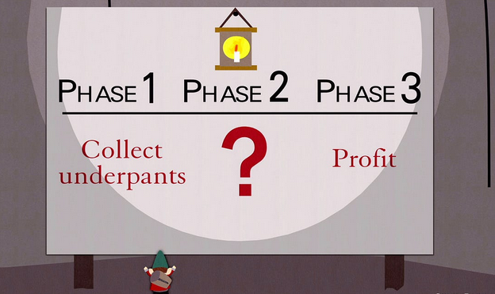

### "Almost Arbitrary” Unauth File Write in Directus CMS <!--  -->

r4bbit | Zombor Máté

---

##### TOC

- Overview of Directus
- Authentication
- Not so authentication
- Vulnerability
- Demo
- Conclussion and lessons

---

##### Overview of Directus

- Real-time API and App dashboard for managing SQL database content
- Allows managing files too (full CRUD)
- Written in Javascript (Typescript)
- ~ 30k starts on Github
- Used by thousands of sites (according to Shodan)

---

##### Overview of Directus


---

##### Overview of Directus


---


---

##### Overview of Directus

Project structure

```bash
.  
├── api  
├── app  
├── cla.md  
├── codecov.yaml  
├── code_of_conduct.md  
├── contributing.md  
├── contributors.yml  
├── crowdin.yml  
├── directus  
├── docker-compose.yml  
├── Dockerfile  
├── ecosystem.config.cjs  
├── eslint.config.js  
├── license  
├── package.json  
├── packages  
├── pnpm-lock.yaml  
├── pnpm-workspace.yaml  
├── readme.md -> directus/readme.md  
├── sdk  
├── security.md  
└── tests
```

---

##### Overview of Directus

```bash
.  
├── api
└── app
```

---

##### Overview of Directus

- `api` - Directus backend (JS)
- `app` - VUE frontend (JS)

---


##### Overview of Directus

Inside the backend

```bash
.
├── app.test.ts
├── app.ts
├── auth
├── auth.ts
├── bus
├── cache.ts
├── cli
├── constants.ts
├── controllers
├── database
├── emitter.ts
├── extensions
├── flows.ts
├── index.ts
├── lock
├── logger
├── mailer.ts
├── metrics
├── middleware
├── operations
├── permissions
├── rate-limiter.ts
├── redis
├── request
├── schedules
├── server.ts
├── services
├── __setup__
├── start.ts
├── storage
├── synchronization.ts
├── telemetry
├── types
├── __utils__
├── utils
└── websocket
```

---

##### Overview of Directus

```bash
.
├── app.ts
├── controllers
└── services 
```

---

##### Overview of Directus

- `app.ts` – Defines paths (bind Routers to URL prefixes)
- `controllers` – Contains endpoint handling funcs
- `services` – Complex modules, sensitive functionality

---

##### Overview of Directus

Structure summary

- API
    - Routers:
    `app.use('/schema', schemaRouter);` <!-- .element: class="fragment" data-fragment-index="2" -->
    - Controllers:
    `schemaRouter.get('/snapshot', asynchandler ….` <!-- .element: class="fragment" data-fragment-index="2" -->
    - Services:
    `SchemaService({ accountability: req.accountability ... });` <!-- .element: class="fragment" data-fragment-index="2" -->

---


---

##### Authentication

---

##### Authentication

- Token parsing
- Accountability model
- Accountability check

---

##### Authentication

```javascript [|3-4|6-9|11-12]
const extractToken: RequestHandler = (req, _res, next) => {
    
	if (req.headers && req.headers.authorization) {
		const parts = req.headers.authorization.split(' ');

		if (parts.length === 2 && parts[0]!.toLowerCase() === 'bearer') {
			...
			token = parts[1]!;
		}
        ...
        req.token = token;
	    next();
	}
```

---

##### Authentication

```javascript [|3-4|7-8]
export const handler = async (req: Request, res: Response, next: NextFunction) => {
	...
    const defaultAccountability: Accountability = 
                createDefaultAccountability({ ip: getIPFromReq(req) });
    ...
	try {
		req.accountability = await getAccountabilityForToken(req.token, 
                                                    defaultAccountability);
	} catch (err) {
		...
	}
	return next();
};
```

---

##### Authentication

```javascript [|2-5]
export type Accountability = {
	role: string | null;
	roles: string[];
	user: string | null;
	admin: boolean;
	app: boolean;
	share?: string;
	ip: string | null;
	userAgent?: string;
	origin?: string;
	session?: string;
};
```

---

##### Authentication

1. Parse incoming token
2. Associate the request with a user using Accountability
3. ????
4. PROFIT



---

##### Authentication

```javascript [|5-7]
router.post(
	'/',
	asyncHandler(multipartHandler),
	asyncHandler(async (req, res, next) => {
		const service = new FilesService({
			accountability: req.accountability,
			schema: req.schema,
		});
    ...
```

---

##### Authentication

```javascript [|5-7|13]
router.post(
	'/',
	asyncHandler(multipartHandler),
	asyncHandler(async (req, res, next) => {
		const service = new FilesService({
			accountability: req.accountability,
			schema: req.schema,
		});

		let keys: PrimaryKey | PrimaryKey[] = [];

		...
		keys = await service.createOne(req.body);
		...
```

---

##### Authentication

```javascript [|1|4-6|14]
const primaryKey = await transaction(this.knex, // knex
	async (trx) => { const payloadAfterHooks =
		opts.emitEvents !== false ? await emitter.emitFilter(
			this.eventScope === 'items'
				? ['items.create', `${this.collection}.items.create`]
				: `${this.eventScope}.create`,
			payload,
			{
				collection: this.collection,
			},
			{
				database: trx,
				schema: this.schema,
				accountability: this.accountability, // acc
			}, ...
```

---

##### Authentication

1. Parse incoming token
2. Associate the request with a user using Accountability
3. `Accountability is checked in services, when the DB is involved`
4. PROFIT

---

##### Authentication


---

##### Lack of authentication

---

##### Lack of authentication

```javascript [|3]
router.post(
	'/apply',
	asyncHandler(schemaMultipartHandler),
	asyncHandler(async (req, res, next) => {
		...
	}),
	respond,
);
```
---

##### Lack of authentication

```javascript [|3|5|7|8-14]
onst schemaMultipartHandler: RequestHandler = (req, res, next) => {
	...
	const busboy = Busboy({ headers });
    ...
	busboy.on('file', async (_, fileStream, { mimeType }) => {
            ...
			const uploadedString = await readableStreamToString..
            if (mimeType === 'application/json') {
                ...
					upload = parseJSON(uploadedString);
				...
			} else {
				...
					upload = await loadYaml(uploadedString);
    ...

```
---

##### Lack of authentication

1. Request flow: `Router → Controller → Service ->`
2. Requests parsed for tokens (basis of auth)
3. Auth checked in the DB through Services
4. Complex processing can happen BEFORE auth

---

##### Vulnerability

---


---


---

##### Vulnerability

```javascript [|3]
router.post(
	'/apply',
	asyncHandler(schemaMultipartHandler),
	asyncHandler(async (req, res, next) => {
		...
	}),
	respond,
);
```

---

##### Vulnerability

`asyncHandler\(.*\),`

---

##### Vulnerability

```javascript [|5|3]
router.patch(
	'/:pk',
	asyncHandler(multipartHandler),
	asyncHandler(async (req, res, next) => {
		const service = new FilesService({
	...
);
```

---

##### Vulnerability

```javascript [|3-4|6|8|9-10|12|14]
export const multipartHandler: RequestHandler = (req, res, next) => {
	...
	const busboy = Busboy(... )
    let payload: any = {};
    ...
    busboy.on('field', (fieldname, val) => { ... payload[fieldname] = val; });
    ...
	busboy.on('file', ...
		mimeTypeAllowed = allowedPatterns.some((pattern) => minimatch..
		if (mimeTypeAllowed === false) { return busboy.emit('error', ... }
        ...
		payload.filename_download ||= filename;
        ...
		const primaryKey = await FilesService.uploadOne(...);
    ...
```

---

##### Vulnerability

```javascript [|1|3|5-6|4]
if (primaryKey) { db_data = ( .. this.knex ....where({ id: primaryKey })...
...
const metadata = { ...(db_data ?? {}), ...clone(payload) };
...
const isReplacement = db_data !== null && primaryKey !== undefined;
if (!isReplacement) { primaryKey = await this.createOne(metadata, ...);}
```

```javascript [8:|1-2|3-4|6|5]
const ext = path.extname(metadata.filename_download!) ...
metadata.filename_disk ||= primaryKey + (fileExtension || '');
if (isReplacement === true && path.extname(metadata.filename_disk!) !== ext)
    metadata.filename_disk = primaryKey + (fileExtension || ''); }
...
const tempFilenameDisk = 'temp_' + metadata.filename_disk;
```

```javascript [14:|2|3-4|1]
...
try { ... disk.write(tempFilenameDisk, stream, metadata.type); ...
if (isReplacement === true) { await this.updateOne(primaryKey, metadata );
...
```

---

##### Vulnerability


---

##### Vulnerability

- We can set an "arbitrary" name for a temporary file
- It's written to disk with arbitrary contents
- We then try to use the file service to update the file data
- We get an authentication error, but a file was already created

---

##### Vulnerability

```javascript []
private fullPath(filepath: string) {
		return join(this.root, join(sep, filepath));
	}
```

---

##### Vulnerability

- We can only upload to the upload dir
- We need to give the file a valid extension
- The file won't show up in Directus
- We need to know a primary key value

---

##### Vulnerability

``` [|2]
content-disposition: inline; filename="a8d0b11a-1494-4b74-8b48-6aa36225db71.png"
content-security-policy: default-src none
date: Tue, 02 Sep 2025 19:46:47 GMT
expires: Thu, 02 Oct 2025 19:46:47 GMT
last-modified: Thu, 13 Jun 2024 18:41:28 GMT
strict-transport-security: max-age=15552000; includeSubDomains; preload
vary: Origin, Cache-Control, Accept-Encodin
x-powered-by: Directus
```

---

##### Demo

> TODO

---

##### Conclusion

- Auth is heavily tied to the DB
    - Code outside of one is unauthenticated!

- File metadata is managed through the DB
    - But its merged into a mutable local var!

- Some service methods used the DB for auth checks
	- But only if the handled resource is DB-resident

---

### Thank you!